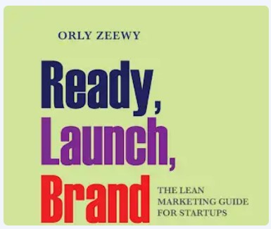
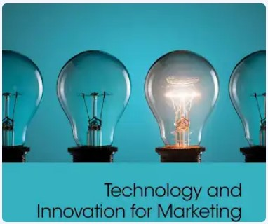
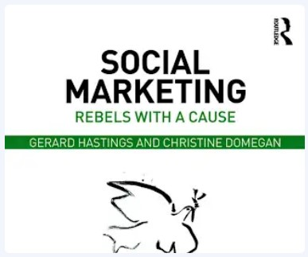

## Reading Material & Working Documents
  

<https://drive.google.com/drive/folders/15Cqgb-2tDDotS5yMiCa0nVk9XlRb6YVW?usp=drive_link>
____

## Session 1: Intro to Marketing

[Session 1 Video Content](https://pgtreau.github.io/session1.html)

### Learning Objective
- Understand the 4 segments that makeup the discipline of marketing. (4 P's of marketing)
- Understand the difference between marketing and advertising.

## Session 2: How value is created

[Session 2 Video Content](https://pgtreau.github.io/session2.html)

### Learning Objective
- Explain what is a value proposition.
- Explain the difference between utility and value.
- Produce of an example "pitching" a value proposition for a business idea. (elevator pitch)
  - This can be a real business or an idea you may have. 

## Session 3: Market Segmentation

[Session 3 Video Content](https://pgtreau.github.io/session3.html)

## Session 4: Product Differentiation

[Session 4 Video Content](https://pgtreau.github.io/session4.html)

## Session 5: Marketing Research Method

[Session 5 Video Content](https://pgtreau.github.io/session5.html)
