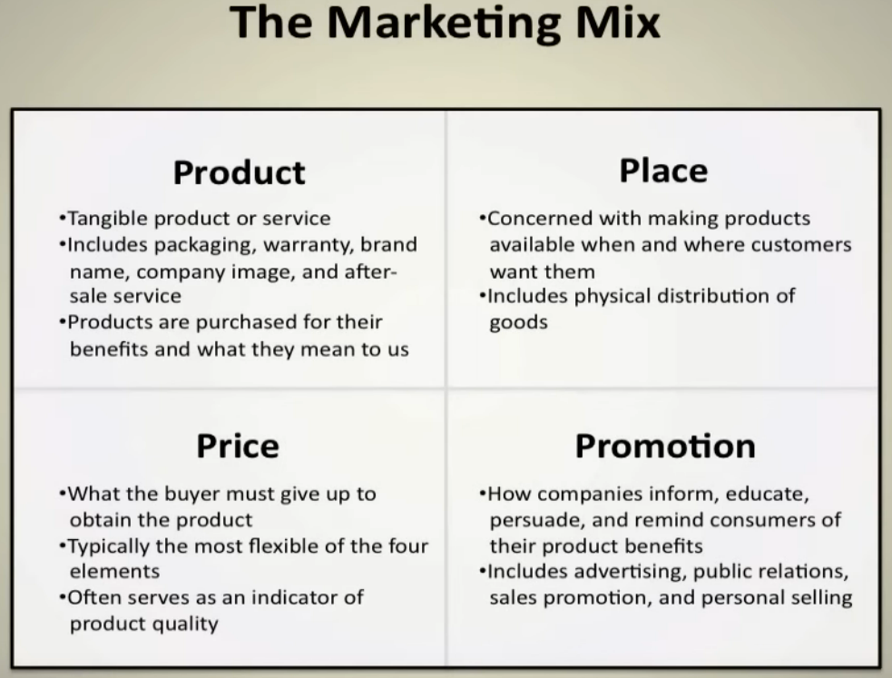

[<- Back to home](https://pgtreau.github.io/marketing.html)
# Chapter 1: Fundamentals of Marketing

**Marketing principles** assert that businesses should strive to satisfy their customers' needs and wants while also achieving their own goals. It involves understanding the target audience, their preferences, and how your product or service can meet their requirements.

**Marketing Mix**  involves the integration of four key aspects of marketing, also known as the **4Ps**.

 The 4Ps stand for:
- Product: What you're selling to customers, whether it's a physical good, a service, or an idea.
- Price: What customers pay to receive the product.
- Place: Where and how the product is sold and distributed to customers.
- Promotion: How customers find out about the product, including advertising, sales promotions, and public relations.

**Importance of Each of the 4Ps**
- Product: This is the starting point for the marketing mix. Companies must understand their customers' needs and wants to develop a product or service that meets them. The product must deliver value to customers and differentiate from competitors' offerings.
- Price: The price must be competitive but also reflect the perceived value of the product. It also needs to take into account factors such as production and distribution costs, competitor pricing, and target customer's willingness to pay.
- Place: The product needs to be available in the right place at the right time to be convenient for customers. This involves decisions about the use of direct sales, wholesalers, retailers, and e-commerce.
- Promotion: This is how companies communicate the benefits of their product to customers. Promotion can include a mix of advertising, public relations, social media, sales promotions, and personal selling. The promotional strategy should effectively reach the target audience and communicate the unique value of the product.

**How the 4Ps are Used in Practice**

In practice, marketers use the 4Ps as a tool to guide their marketing strategy. Here's a simple example:
- Product: A company identifies a gap in the market for a high-quality, organic energy drink. They develop a product that meets these needs, with attractive packaging that appeals to health-conscious consumers.
- Price: The company prices the product at a premium compared to standard energy drinks. This reflects the high-quality, organic ingredients used, and aligns with the expectations of their target market who are willing to pay more for healthier options.
- Place: The product is sold in health food stores, gyms, and cafes, as well as online. These are places where the target customers are likely to shop.
- Promotion: The company promotes the product through social media campaigns, influencer partnerships, and in-store sampling events. They emphasize the organic, high-quality ingredients in their messaging.

By aligning each of the 4Ps with their overall marketing strategy, the company is able to successfully introduce a new product to the market and attract their target customers.

<iframe width="853" height="480" src="https://www.youtube.com/embed/qWlhzTI0ooo?list=PL14BB28B5FE99A733" title="Introduction to Marketing: The Importance of Product, Price, Place, &amp; Promotion | Episode 118" frameborder="0" allow="accelerometer; autoplay; clipboard-write; encrypted-media; gyroscope; picture-in-picture; web-share" allowfullscreen></iframe>

<iframe width="853" height="480" src="https://www.youtube.com/embed/AyyvFASW6Nw" title="The Difference Between Goods & Services" frameborder="0" allow="accelerometer; autoplay; clipboard-write; encrypted-media; gyroscope; picture-in-picture; web-share" allowfullscreen></iframe> 

The **consumer buying process**, also known as the buyer's journey or the decision-making process, typically consists of five stages:

1. **Need Recognition**: The buying process begins when the consumer recognizes a need or a problem that needs to be solved. This could be triggered by internal stimuli (like hunger or thirst) or external stimuli (like marketing efforts or word-of-mouth). Marketers use strategies like advertising, sales promotions, and content marketing to stimulate recognition of a need or desire.
3. **Information Search**: Once the need is recognized, the consumer seeks information to help make a purchase decision. This could involve online research, reading reviews, asking friends or family, or visiting stores. Companies can provide detailed product information, positive customer reviews, and helpful content on their websites and social media platforms to influence the information search stage.
4. **Evaluation of Alternatives**: The consumer evaluates different products or brands based on their perceived ability to meet the recognized need. Factors considered may include price, quality, features, brand reputation, and others. Marketers can emphasize the unique features, benefits, and value of their product to help it stand out from alternatives. They can also use strategies like offering free trials or samples to encourage consumers to evaluate their product.
5. **Purchase Decision**: The consumer makes a decision on which product to buy based on their evaluation. This stage can still be influenced by other factors, such as promotional offers, availability, or a salesperson's influence. Companies can make the purchase decision easier by offering convenient purchase options, excellent customer service, secure payment options, and attractive promotions.
6. **Post-Purchase Behavior**: After the purchase, the consumer evaluates the product based on their expectations. If the product meets or exceeds expectations, the consumer may become a repeat customer and recommend the product to others. If it fails to meet expectations, the consumer may return the product, write a negative review, or choose a different product next time. After the purchase, companies can follow up with customers through email, surveys, or social media to encourage positive reviews, address any issues, and build a relationship with the customer.

**Importance of the Consumer Buying Process to Marketers**

Understanding the consumer buying process is crucial for marketers for several reasons:
1. **Effective targeting**: By understanding what consumers are looking for at each stage of the buying process, marketers can deliver the right message at the right time. For example, during the information search stage, providing detailed product information and positive reviews can help influence the consumer's evaluation.
2. **Improving customer experience**: By understanding the buying process, companies can remove obstacles and make the process easier and more enjoyable for consumers, improving customer satisfaction and loyalty.
3. **Increasing sales**: Understanding how and why consumers make buying decisions can help companies better position their products and develop more effective marketing strategies, leading to increased sales.

<iframe width="853" height="480" src="https://www.youtube.com/embed/JD7nO-8D3r8" title="The Consumer Buying Process: How Consumers Make Product Purchase Decisions" frameborder="0" allow="accelerometer; autoplay; clipboard-write; encrypted-media; gyroscope; picture-in-picture; web-share" allowfullscreen></iframe>

### Learning Objective
- Understand the 4 segments that makeup the discipline of marketing. (4 P's of marketing)
- Understand the difference between marketing and advertising.
